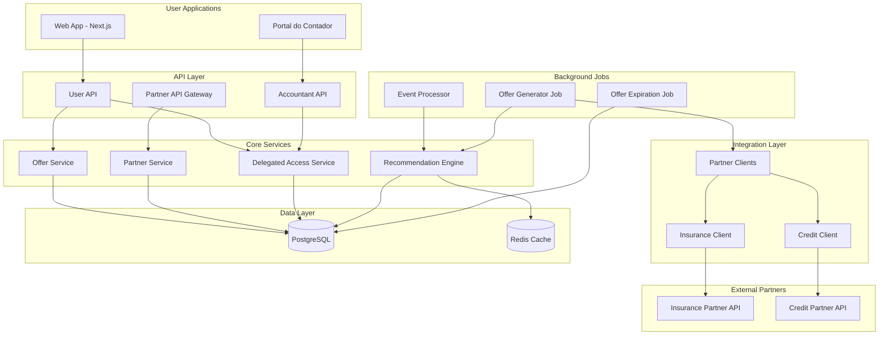
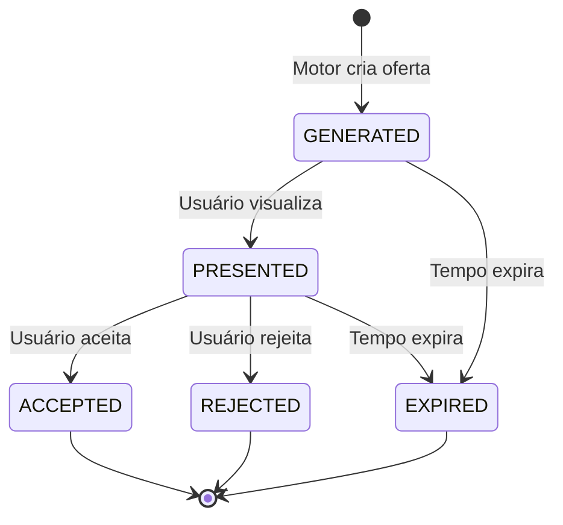
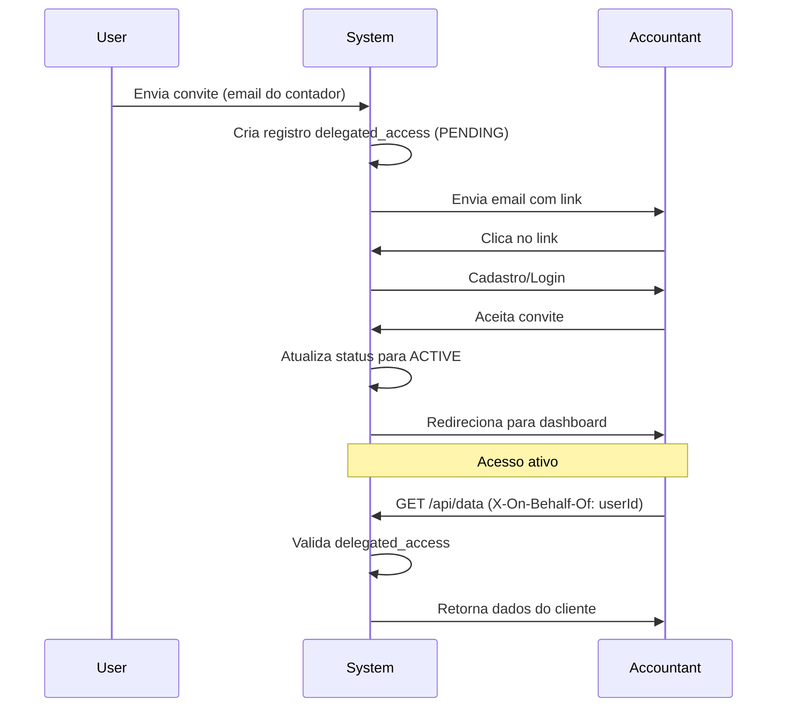

# Design Document

## Overview

Este documento descreve o design técnico para transformar a Horizon AI em uma plataforma de marketplace de produtos financeiros personalizados. A solução implementa um ecossistema B2B2C onde usuários recebem ofertas proativas de produtos financeiros (seguros, crédito, investimentos) baseadas em seus dados reais, enquanto parceiros acessam uma base de usuários qualificados através de uma API segura.

O design prioriza três pilares fundamentais:

- **Personalização em Escala**: Motor de recomendação que avalia elegibilidade em tempo real
- **Segurança e Confiança**: Arquitetura que protege dados sensíveis em todas as camadas
- **Escalabilidade**: Arquitetura serverless que suporta crescimento sem degradação de performance

## Architecture

### High-Level Architecture



### Technology Stack

- **Frontend**: Next.js 14 (App Router), React, TypeScript, Tailwind CSS
- **Backend**: Next.js API Routes (Serverless Functions on Vercel)
- **Database**: PostgreSQL (Neon/Supabase) com Drizzle ORM
- **Cache**: Redis (Upstash) para performance
- **Authentication**: NextAuth.js com suporte a múltiplas roles
- **Background Jobs**: Vercel Cron Jobs + Inngest para processamento assíncrono
- **Monitoring**: Vercel Analytics + Sentry para error tracking
- **Partner Integration**: Axios com retry logic e circuit breakers

## Components and Interfaces

### 1. Recommendation Engine

O motor de recomendação é o coração do marketplace, responsável por fazer o match entre usuários e produtos.

#### Interface

```typescript
interface RecommendationEngine {
  // Avalia todos os produtos para um usuário específico
  evaluateUserEligibility(userId: string): Promise<Offer[]>;

  // Avalia um produto específico para um usuário
  evaluateProductEligibility(
    userId: string,
    productId: string
  ): Promise<Offer | null>;

  // Processa eventos que podem gerar novas ofertas
  processEvent(event: UserEvent): Promise<void>;
}

interface UserEvent {
  type: "USER_SIGNUP" | "ASSET_CONNECTED" | "WEALTH_CHANGE" | "LIFE_EVENT";
  userId: string;
  metadata: Record<string, any>;
}

interface Offer {
  userId: string;
  productId: string;
  offerDetails: Record<string, any>;
  justification: string;
  expiresAt: Date;
}
```

#### Implementation Strategy

**Fase 1: Rule-Based Engine**

- Implementação inicial usando regras explícitas em TypeScript
- Critérios de elegibilidade armazenados como JSON no banco
- Avaliação síncrona durante eventos do usuário

```typescript
// Exemplo de regra para Seguro de Vida
const lifeInsuranceRule = {
  productId: "life-insurance-premium",
  eligibilityCriteria: {
    minNetWorth: 500000,
    minAge: 30,
    maxAge: 65,
    hasDependents: true,
  },
  offerGenerator: async (userProfile) => {
    const coverage = userProfile.netWorth * 2;
    const monthlyPremium = calculatePremium(userProfile);

    return {
      coverage,
      monthlyPremium,
      justification: `Recomendado com base no seu patrimônio de ${formatCurrency(
        userProfile.netWorth
      )} e perfil familiar.`,
    };
  },
};
```

**Fase 2: ML-Enhanced Engine** (Futuro)

- Modelo de ML para scoring de propensão
- A/B testing de diferentes estratégias de recomendação
- Feedback loop baseado em conversões

#### Triggers

O motor é acionado por eventos específicos:

1. **onUserSignup**: Avalia produtos de boas-vindas
2. **onAssetConnected**: Avalia produtos relacionados ao tipo de ativo
3. **onWealthChange**: Reavalia produtos de wealth management quando patrimônio muda >20%
4. **onLifeEventDetected**: Avalia produtos relacionados (ex: seguro de vida ao detectar dependentes)

### 2. Offer Service

Gerencia o ciclo de vida completo das ofertas.

#### Interface

```typescript
interface OfferService {
  // Cria uma nova oferta
  createOffer(offer: CreateOfferInput): Promise<Offer>;

  // Lista ofertas ativas para um usuário
  getActiveOffers(userId: string): Promise<Offer[]>;

  // Obtém detalhes de uma oferta específica
  getOfferDetails(offerId: string): Promise<OfferDetails>;

  // Usuário aceita uma oferta
  acceptOffer(offerId: string, userId: string): Promise<void>;

  // Usuário rejeita uma oferta
  rejectOffer(offerId: string, userId: string): Promise<void>;

  // Expira ofertas automaticamente
  expireOffers(): Promise<number>;
}

interface CreateOfferInput {
  userId: string;
  productId: string;
  offerDetails: Record<string, any>;
  justification: string;
  expiresAt: Date;
}

interface OfferDetails extends Offer {
  product: MarketplaceProduct;
  partner: Partner;
}
```

#### State Machine



### 3. Partner Service

Gerencia parceiros e seus produtos.

#### Interface

```typescript
interface PartnerService {
  // Registra um novo parceiro
  registerPartner(partner: RegisterPartnerInput): Promise<Partner>;

  // Adiciona um produto ao catálogo
  addProduct(product: AddProductInput): Promise<MarketplaceProduct>;

  // Sincroniza catálogo de um parceiro
  syncPartnerCatalog(partnerId: string): Promise<void>;

  // Notifica parceiro sobre oferta aceita
  notifyOfferAccepted(offerId: string): Promise<void>;
}

interface RegisterPartnerInput {
  name: string;
  category: "INSURANCE" | "CREDIT" | "WEALTH_MANAGEMENT";
  contactInfo: Record<string, any>;
  apiCredentials: {
    baseUrl: string;
    clientId: string;
    clientSecret: string;
  };
}

interface AddProductInput {
  partnerId: string;
  productCode: string;
  name: string;
  description: string;
  eligibilityCriteria: Record<string, any>;
}
```

### 4. Partner API Gateway

API segura para comunicação com parceiros externos.

#### Endpoints

```typescript
// POST /api/partner/v1/offers/create
interface CreateOfferRequest {
  offerId: string;
  userData: {
    userId: string;
    // Dados necessários para formalização
  };
}

// GET /api/partner/v1/products/catalog
interface CatalogResponse {
  products: Array<{
    productCode: string;
    name: string;
    description: string;
    eligibilityCriteria: Record<string, any>;
  }>;
}

// POST /api/partner/v1/auth/token
interface TokenRequest {
  grant_type: "client_credentials";
  client_id: string;
  client_secret: string;
}

interface TokenResponse {
  access_token: string;
  token_type: "Bearer";
  expires_in: number;
}
```

#### Security Layers

1. **Authentication**: OAuth 2.0 Client Credentials
2. **Rate Limiting**: 100 requests/minute por parceiro
3. **Payload Validation**: Zod schemas para todos os endpoints
4. **Encryption**: TLS 1.3 para todas as comunicações
5. **Audit Logging**: Registro completo de todas as chamadas

### 5. Delegated Access Service

Gerencia o sistema de acesso delegado para contadores.

#### Interface

```typescript
interface DelegatedAccessService {
  // Envia convite para contador
  inviteAccountant(
    userId: string,
    accountantEmail: string
  ): Promise<Invitation>;

  // Aceita convite
  acceptInvitation(invitationId: string, accountantId: string): Promise<void>;

  // Revoga acesso
  revokeAccess(userId: string, accountantId: string): Promise<void>;

  // Verifica se contador tem acesso
  hasAccess(accountantId: string, userId: string): Promise<boolean>;

  // Lista clientes de um contador
  getAccountantClients(accountantId: string): Promise<User[]>;
}

interface Invitation {
  id: string;
  ownerUserId: string;
  accountantEmail: string;
  status: "PENDING" | "ACCEPTED" | "EXPIRED";
  expiresAt: Date;
}
```

#### Authorization Flow



### 6. Partner Clients

Abstração para comunicação com APIs de parceiros.

#### Base Client

```typescript
abstract class BasePartnerClient {
  protected baseUrl: string;
  protected credentials: PartnerCredentials;
  protected circuitBreaker: CircuitBreaker;

  constructor(config: PartnerClientConfig) {
    this.baseUrl = config.baseUrl;
    this.credentials = config.credentials;
    this.circuitBreaker = new CircuitBreaker({
      failureThreshold: 5,
      resetTimeout: 60000,
    });
  }

  protected async request<T>(
    method: string,
    endpoint: string,
    data?: any
  ): Promise<T> {
    return this.circuitBreaker.execute(async () => {
      const response = await axios({
        method,
        url: `${this.baseUrl}${endpoint}`,
        data,
        headers: await this.getAuthHeaders(),
        timeout: 10000,
      });

      return response.data;
    });
  }

  protected abstract getAuthHeaders(): Promise<Record<string, string>>;
}
```

#### Insurance Client

```typescript
class InsurancePartnerClient extends BasePartnerClient {
  async getQuote(userData: UserProfile): Promise<InsuranceQuote> {
    return this.request("POST", "/quotes", {
      age: userData.age,
      netWorth: userData.netWorth,
      hasDependents: userData.hasDependents,
      healthProfile: userData.healthProfile,
    });
  }

  async finalizePolicy(offerData: OfferData): Promise<PolicyConfirmation> {
    return this.request("POST", "/policies", offerData);
  }
}

interface InsuranceQuote {
  coverage: number;
  monthlyPremium: number;
  annualPremium: number;
  quoteId: string;
  expiresAt: string;
}
```

## Data Models

### Database Schema

```typescript
// Parceiros
export const partners = pgTable("partners", {
  id: text("id")
    .primaryKey()
    .$defaultFn(() => createId()),
  name: text("name").notNull().unique(),
  category: partnerCategoryEnum("category").notNull(),
  contactInfo: jsonb("contact_info"),
  encryptedApiKeys: text("encrypted_api_keys").notNull(),
  isActive: boolean("is_active").default(true).notNull(),
  createdAt: timestamp("created_at").defaultNow().notNull(),
  updatedAt: timestamp("updated_at").defaultNow().notNull(),
});

// Produtos do Marketplace
export const marketplaceProducts = pgTable("marketplace_products", {
  id: text("id")
    .primaryKey()
    .$defaultFn(() => createId()),
  partnerId: text("partner_id")
    .notNull()
    .references(() => partners.id),
  productCode: text("product_code").notNull(),
  name: text("name").notNull(),
  description: text("description"),
  category: text("category").notNull(),
  eligibilityCriteria: jsonb("eligibility_criteria").notNull(),
  isActive: boolean("is_active").default(true).notNull(),
  createdAt: timestamp("created_at").defaultNow().notNull(),
  updatedAt: timestamp("updated_at").defaultNow().notNull(),
});

// Ofertas aos Usuários
export const userOffers = pgTable("user_offers", {
  id: text("id")
    .primaryKey()
    .$defaultFn(() => createId()),
  userId: text("user_id")
    .notNull()
    .references(() => users.id, { onDelete: "cascade" }),
  productId: text("product_id")
    .notNull()
    .references(() => marketplaceProducts.id),
  status: offerStatusEnum("status").default("GENERATED").notNull(),
  offerDetails: jsonb("offer_details").notNull(),
  justification: text("justification").notNull(),
  expiresAt: timestamp("expires_at").notNull(),
  presentedAt: timestamp("presented_at"),
  respondedAt: timestamp("responded_at"),
  createdAt: timestamp("created_at").defaultNow().notNull(),
});

// Acesso Delegado (Contadores)
export const delegatedAccess = pgTable("delegated_access", {
  id: text("id")
    .primaryKey()
    .$defaultFn(() => createId()),
  ownerUserId: text("owner_user_id")
    .notNull()
    .references(() => users.id, { onDelete: "cascade" }),
  delegateUserId: text("delegate_user_id").references(() => users.id, {
    onDelete: "cascade",
  }),
  delegateEmail: text("delegate_email").notNull(),
  status: text("status").notNull(), // PENDING, ACTIVE, REVOKED, EXPIRED
  invitationToken: text("invitation_token").unique(),
  expiresAt: timestamp("expires_at"),
  createdAt: timestamp("created_at").defaultNow().notNull(),
  acceptedAt: timestamp("accepted_at"),
  revokedAt: timestamp("revoked_at"),
});

// Extensão da tabela users para suportar role de contador
export const users = pgTable("users", {
  // ... campos existentes ...
  role: text("role").default("USER").notNull(), // USER, ACCOUNTANT, ADMIN
});

// Métricas do Marketplace
export const marketplaceMetrics = pgTable("marketplace_metrics", {
  id: text("id")
    .primaryKey()
    .$defaultFn(() => createId()),
  metricType: text("metric_type").notNull(), // OFFER_GENERATED, OFFER_PRESENTED, OFFER_ACCEPTED, etc.
  offerId: text("offer_id").references(() => userOffers.id),
  userId: text("user_id").references(() => users.id),
  partnerId: text("partner_id").references(() => partners.id),
  metadata: jsonb("metadata"),
  createdAt: timestamp("created_at").defaultNow().notNull(),
});
```

### Indexes

```sql
-- Performance indexes
CREATE INDEX idx_user_offers_user_status ON user_offers(user_id, status);
CREATE INDEX idx_user_offers_expires ON user_offers(expires_at) WHERE status IN ('GENERATED', 'PRESENTED');
CREATE INDEX idx_delegated_access_delegate ON delegated_access(delegate_user_id, status);
CREATE INDEX idx_delegated_access_owner ON delegated_access(owner_user_id, status);
CREATE INDEX idx_marketplace_products_partner ON marketplace_products(partner_id, is_active);
CREATE INDEX idx_marketplace_metrics_type_date ON marketplace_metrics(metric_type, created_at);
```

## Error Handling

### Error Categories

1. **Partner Integration Errors**
   - API indisponível: Retry com exponential backoff
   - Timeout: Circuit breaker após 5 falhas consecutivas
   - Dados inválidos: Log e notificação para equipe técnica

2. **User-Facing Errors**
   - Oferta expirada: Mensagem clara com opção de solicitar nova cotação
   - Produto indisponível: Sugestão de produtos alternativos
   - Erro de autorização: Mensagem de acesso negado

3. **System Errors**
   - Database errors: Retry automático + fallback para cache
   - Background job failures: Dead letter queue + alertas

### Circuit Breaker Pattern

```typescript
class CircuitBreaker {
  private state: "CLOSED" | "OPEN" | "HALF_OPEN" = "CLOSED";
  private failureCount = 0;
  private lastFailureTime?: Date;

  async execute<T>(fn: () => Promise<T>): Promise<T> {
    if (this.state === "OPEN") {
      if (this.shouldAttemptReset()) {
        this.state = "HALF_OPEN";
      } else {
        throw new Error("Circuit breaker is OPEN");
      }
    }

    try {
      const result = await fn();
      this.onSuccess();
      return result;
    } catch (error) {
      this.onFailure();
      throw error;
    }
  }

  private onSuccess() {
    this.failureCount = 0;
    this.state = "CLOSED";
  }

  private onFailure() {
    this.failureCount++;
    this.lastFailureTime = new Date();

    if (this.failureCount >= this.failureThreshold) {
      this.state = "OPEN";
    }
  }
}
```

## Testing Strategy

### Unit Tests

- **Recommendation Engine**: Testar regras de elegibilidade com diferentes perfis de usuário
- **Offer Service**: Testar transições de estado e validações
- **Partner Clients**: Testar com mocks das APIs de parceiros
- **Delegated Access**: Testar fluxos de convite, aceitação e revogação

### Integration Tests

- **Partner API Gateway**: Testar autenticação OAuth e rate limiting
- **Background Jobs**: Testar geração e expiração de ofertas
- **Database Operations**: Testar queries complexas e transações

### E2E Tests

- **User Flow**: Cadastro → Conexão de ativos → Recebimento de oferta → Aceitação
- **Accountant Flow**: Convite → Aceitação → Visualização de dados do cliente
- **Partner Flow**: Sincronização de catálogo → Recebimento de notificação de oferta aceita

### Performance Tests

- **Load Testing**: Simular 1000 usuários simultâneos no marketplace
- **Stress Testing**: Testar comportamento com 10x o tráfego esperado
- **Spike Testing**: Testar recuperação após picos súbitos

## Security Considerations

### Data Protection

1. **Encryption at Rest**
   - Chaves de API de parceiros: AES-256
   - Dados sensíveis de usuários: Criptografia em nível de coluna

2. **Encryption in Transit**
   - TLS 1.3 para todas as comunicações
   - Certificate pinning para APIs de parceiros

3. **Access Control**
   - RBAC (Role-Based Access Control) para diferentes tipos de usuários
   - Validação de acesso delegado em cada request
   - Audit logs para todas as operações sensíveis

### Partner Security

1. **API Key Management**
   - Rotação automática de chaves a cada 90 dias
   - Armazenamento seguro usando secrets management (Vercel Environment Variables)

2. **Rate Limiting**
   - Por parceiro: 100 req/min
   - Por IP: 1000 req/hour
   - Throttling progressivo em caso de abuso

3. **Webhook Verification**
   - HMAC signatures para validar origem
   - Replay attack prevention com timestamps

### Compliance

- **LGPD**: Consentimento explícito para compartilhamento de dados com parceiros
- **Audit Trail**: Registro de todos os acessos e compartilhamentos de dados
- **Data Retention**: Políticas claras de retenção e exclusão de dados

## Performance Optimization

### Caching Strategy

```typescript
// Cache de perfil do usuário (usado pelo motor de recomendação)
const userProfileCache = {
  key: (userId: string) => `user:profile:${userId}`,
  ttl: 3600, // 1 hora
  invalidateOn: ["ASSET_CONNECTED", "WEALTH_CHANGE"],
};

// Cache de produtos ativos
const activeProductsCache = {
  key: "marketplace:products:active",
  ttl: 300, // 5 minutos
  invalidateOn: ["PRODUCT_ADDED", "PRODUCT_UPDATED"],
};

// Cache de ofertas ativas do usuário
const userOffersCache = {
  key: (userId: string) => `user:offers:${userId}`,
  ttl: 60, // 1 minuto
  invalidateOn: ["OFFER_CREATED", "OFFER_UPDATED"],
};
```

### Database Optimization

1. **Connection Pooling**: Máximo de 20 conexões simultâneas
2. **Query Optimization**: Uso de indexes apropriados
3. **Batch Operations**: Processar múltiplas ofertas em uma única transação
4. **Read Replicas**: Para queries de leitura pesadas (dashboard do contador)

### Async Processing

```typescript
// Processamento assíncrono de eventos usando Inngest
export const processUserEvent = inngest.createFunction(
  { id: "process-user-event" },
  { event: "user/event" },
  async ({ event, step }) => {
    // Step 1: Avaliar elegibilidade
    const eligibleProducts = await step.run(
      "evaluate-eligibility",
      async () => {
        return recommendationEngine.evaluateUserEligibility(event.data.userId);
      }
    );

    // Step 2: Gerar ofertas (em paralelo)
    await step.run("generate-offers", async () => {
      return Promise.all(
        eligibleProducts.map((product) =>
          offerService.createOffer({
            userId: event.data.userId,
            productId: product.id,
            offerDetails: product.offerDetails,
            justification: product.justification,
            expiresAt: product.expiresAt,
          })
        )
      );
    });

    // Step 3: Notificar usuário
    await step.run("notify-user", async () => {
      return notificationService.sendOfferNotification(event.data.userId);
    });
  }
);
```

## Deployment Strategy

### Phased Rollout

**Phase 1: MVP - Insurance Marketplace** (Meses 1-3)

- Integração com 1 parceiro de seguros
- Motor de recomendação baseado em regras
- UI básica do marketplace
- Métricas fundamentais

**Phase 2: Expansion** (Meses 4-6)

- Integração com parceiros de crédito
- Portal do contador V1
- Melhorias no motor de recomendação
- A/B testing de ofertas

**Phase 3: Scale** (Meses 7-12)

- Integração com parceiros de wealth management
- Motor de recomendação com ML
- Portal do contador V2 com features avançadas
- Otimizações de performance

### Feature Flags

```typescript
const featureFlags = {
  MARKETPLACE_ENABLED: true,
  INSURANCE_OFFERS: true,
  CREDIT_OFFERS: false, // Fase 2
  WEALTH_OFFERS: false, // Fase 3
  ACCOUNTANT_PORTAL: false, // Fase 2
  ML_RECOMMENDATIONS: false, // Fase 3
};
```

### Monitoring & Alerts

```typescript
// Métricas críticas para monitorar
const criticalMetrics = {
  // Performance
  "api.response_time.p95": { threshold: 500, unit: "ms" },
  "partner.api.timeout_rate": { threshold: 0.05, unit: "percentage" },

  // Business
  "offers.conversion_rate": { threshold: 0.1, unit: "percentage" },
  "marketplace.arr": { threshold: 10000000, unit: "BRL" },

  // Errors
  "errors.rate": { threshold: 0.01, unit: "percentage" },
  "circuit_breaker.open": { threshold: 1, unit: "count" },
};
```

## Migration Path

Para implementar este design em um sistema existente:

1. **Database Migration**: Adicionar novas tabelas sem impactar tabelas existentes
2. **Feature Flag**: Lançar marketplace como feature opt-in inicialmente
3. **Backward Compatibility**: Manter APIs existentes funcionando
4. **Gradual Rollout**: Começar com 5% dos usuários, aumentar gradualmente
5. **Rollback Plan**: Capacidade de desabilitar marketplace instantaneamente via feature flag
