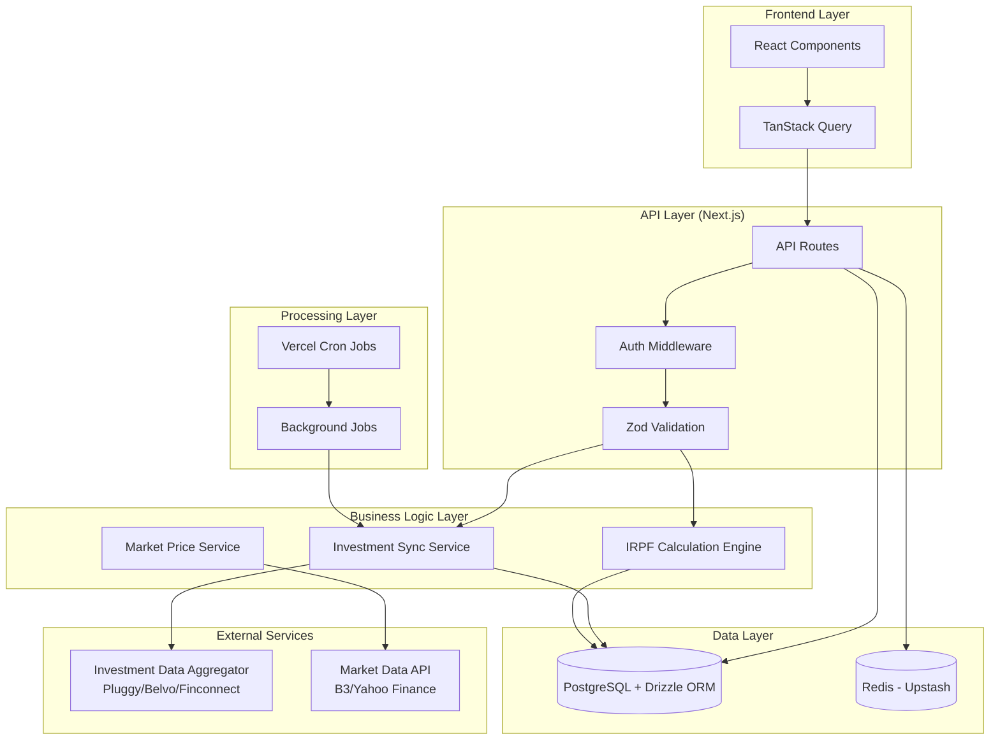
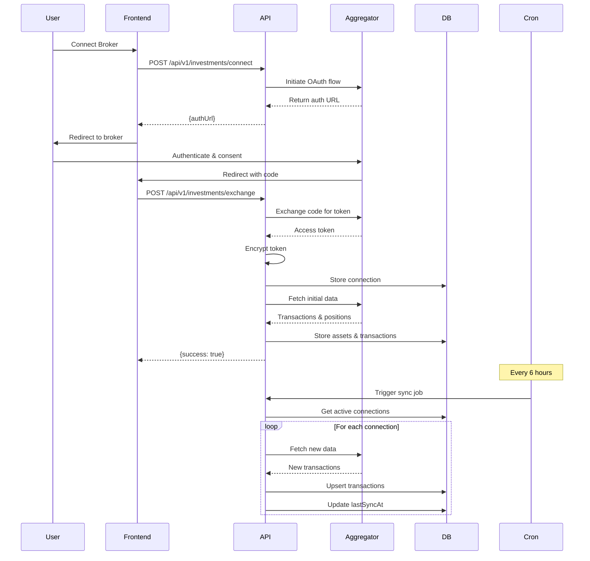
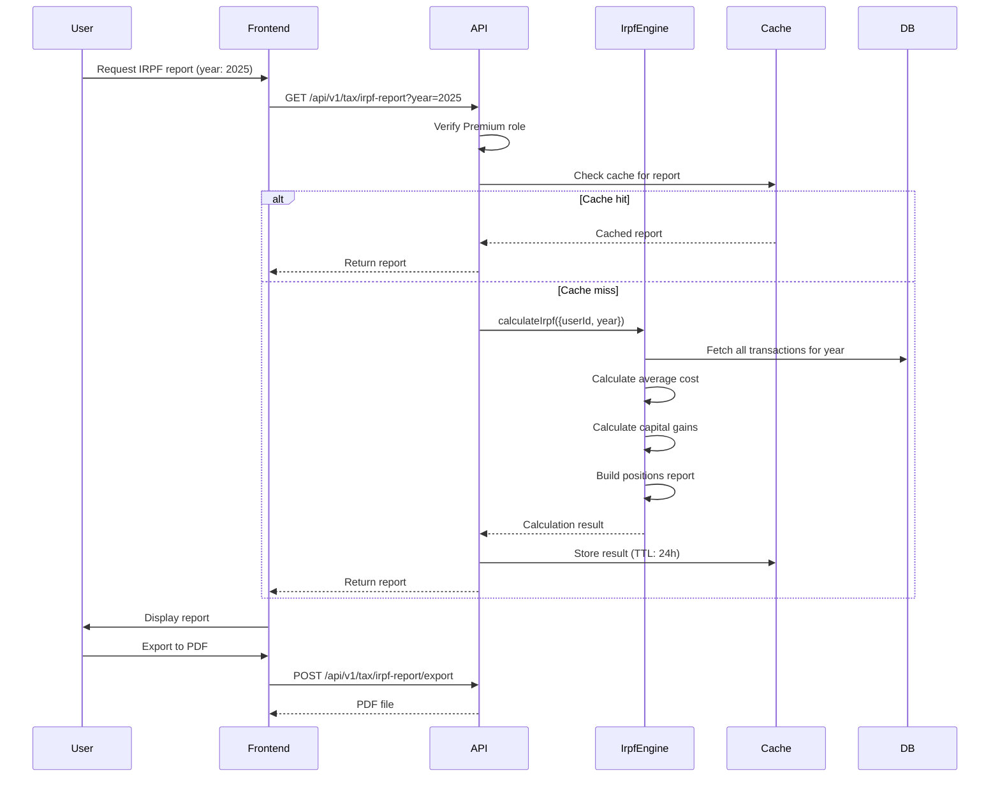

# Design Document

## Overview

O Cérebro Financeiro representa a evolução da Horizon AI para um sistema operacional patrimonial completo. Esta solução integra dados de investimentos de múltiplas corretoras e automatiza o cálculo do Imposto de Renda (IRPF), eliminando a complexidade fiscal que aflige investidores brasileiros.

A arquitetura mantém a stack Next.js existente, adicionando um motor de cálculo fiscal robusto, integração com agregadores de dados financeiros, e processamento assíncrono para sincronização de investimentos. O design prioriza precisão absoluta nos cálculos fiscais, segurança de dados sensíveis e performance para processar milhares de transações.

## Architecture

### High-Level Architecture



### Investment Sync Flow



### IRPF Calculation Flow



## Components and Interfaces

### Database Schema Extensions

```typescript
// src/lib/db/schema.ts - New tables

import {
  pgTable,
  text,
  timestamp,
  pgEnum,
  integer,
  decimal,
  uniqueIndex,
} from "drizzle-orm/pg-core";
import { createId } from "@paralleldrive/cuid2";

// Enums
export const assetTypeEnum = pgEnum("asset_type", [
  "STOCK", // Ações
  "BDR", // Brazilian Depositary Receipts
  "ETF", // Exchange Traded Funds
  "FII", // Fundos Imobiliários
  "CRYPTO", // Criptomoedas
  "FIXED_INCOME", // Renda Fixa
]);

export const transactionTypeEnum = pgEnum("investment_transaction_type", [
  "BUY",
  "SELL",
]);

export const connectionStatusEnum = pgEnum("investment_connection_status", [
  "ACTIVE",
  "EXPIRED",
  "ERROR",
  "DISCONNECTED",
]);

// Investment Connections Table
export const investmentConnections = pgTable("investment_connections", {
  id: text("id")
    .primaryKey()
    .$defaultFn(() => createId()),
  userId: text("user_id")
    .notNull()
    .references(() => users.id, { onDelete: "cascade" }),
  brokerName: text("broker_name").notNull(),
  brokerInstitutionId: text("broker_institution_id").notNull(),
  encryptedAccessToken: text("encrypted_access_token").notNull(),
  encryptedRefreshToken: text("encrypted_refresh_token"),
  tokenExpiresAt: timestamp("token_expires_at", { withTimezone: true }),
  status: connectionStatusEnum("status").default("ACTIVE").notNull(),
  lastSyncAt: timestamp("last_sync_at", { withTimezone: true }),
  syncError: text("sync_error"),
  consentExpiresAt: timestamp("consent_expires_at", { withTimezone: true }),
  createdAt: timestamp("created_at", { withTimezone: true })
    .defaultNow()
    .notNull(),
  updatedAt: timestamp("updated_at", { withTimezone: true })
    .defaultNow()
    .notNull(),
});

// Investment Assets Table
export const investmentAssets = pgTable(
  "investment_assets",
  {
    id: text("id")
      .primaryKey()
      .$defaultFn(() => createId()),
    userId: text("user_id")
      .notNull()
      .references(() => users.id, { onDelete: "cascade" }),
    ticker: text("ticker").notNull(),
    assetType: assetTypeEnum("asset_type").notNull(),
    name: text("name"),
    cnpj: text("cnpj"), // For IRPF reporting
    currentQuantity: integer("current_quantity").default(0).notNull(),
    averageCost: decimal("average_cost", { precision: 15, scale: 2 }),
    lastPrice: decimal("last_price", { precision: 15, scale: 2 }),
    lastPriceUpdatedAt: timestamp("last_price_updated_at", {
      withTimezone: true,
    }),
    createdAt: timestamp("created_at", { withTimezone: true })
      .defaultNow()
      .notNull(),
    updatedAt: timestamp("updated_at", { withTimezone: true })
      .defaultNow()
      .notNull(),
  },
  (table) => {
    return {
      userTickerUnq: uniqueIndex("user_ticker_unq").on(
        table.userId,
        table.ticker
      ),
    };
  }
);

// Investment Transactions Table
export const investmentTransactions = pgTable(
  "investment_transactions",
  {
    id: text("id")
      .primaryKey()
      .$defaultFn(() => createId()),
    assetId: text("asset_id")
      .notNull()
      .references(() => investmentAssets.id, { onDelete: "cascade" }),
    userId: text("user_id")
      .notNull()
      .references(() => users.id, { onDelete: "cascade" }),
    connectionId: text("connection_id")
      .notNull()
      .references(() => investmentConnections.id, { onDelete: "cascade" }),
    externalId: text("external_id").notNull(), // ID from broker
    type: transactionTypeEnum("type").notNull(),
    quantity: integer("quantity").notNull(),
    pricePerUnit: decimal("price_per_unit", {
      precision: 15,
      scale: 2,
    }).notNull(),
    totalCost: decimal("total_cost", { precision: 15, scale: 2 }).notNull(), // Including fees
    fees: decimal("fees", { precision: 15, scale: 2 }).default("0").notNull(),
    transactionDate: timestamp("transaction_date", {
      withTimezone: true,
    }).notNull(),
    createdAt: timestamp("created_at", { withTimezone: true })
      .defaultNow()
      .notNull(),
  },
  (table) => {
    return {
      userDateIdx: index("inv_trans_user_date_idx").on(
        table.userId,
        table.transactionDate
      ),
      assetDateIdx: index("inv_trans_asset_date_idx").on(
        table.assetId,
        table.transactionDate
      ),
    };
  }
);

// Capital Gains Cache Table (for performance)
export const capitalGainsCache = pgTable(
  "capital_gains_cache",
  {
    id: text("id")
      .primaryKey()
      .$defaultFn(() => createId()),
    userId: text("user_id")
      .notNull()
      .references(() => users.id, { onDelete: "cascade" }),
    year: integer("year").notNull(),
    month: integer("month").notNull(),
    assetType: assetTypeEnum("asset_type").notNull(),
    totalSold: decimal("total_sold", { precision: 15, scale: 2 }).notNull(),
    totalProfit: decimal("total_profit", { precision: 15, scale: 2 }).notNull(),
    totalLoss: decimal("total_loss", { precision: 15, scale: 2 }).notNull(),
    taxDue: decimal("tax_due", { precision: 15, scale: 2 }).notNull(),
    isExempt: boolean("is_exempt").default(false).notNull(),
    createdAt: timestamp("created_at", { withTimezone: true })
      .defaultNow()
      .notNull(),
  },
  (table) => {
    return {
      userYearMonthUnq: uniqueIndex("user_year_month_type_unq").on(
        table.userId,
        table.year,
        table.month,
        table.assetType
      ),
    };
  }
);
```

### API Endpoints

#### Investment Connection Management

**POST /api/v1/investments/connect**

- Auth: Required (JWT)
- Request: `{ institutionId: string }`
- Response: `{ authUrl: string, connectionId: string }`
- Logic: Initiate OAuth flow with aggregator

**POST /api/v1/investments/exchange**

- Auth: Required (JWT)
- Request: `{ connectionId: string, code: string }`
- Response: `{ success: boolean }`
- Logic: Exchange auth code, encrypt tokens, trigger initial sync

**GET /api/v1/investments/connections**

- Auth: Required (JWT)
- Response: `{ connections: Connection[] }`
- Logic: List user's broker connections with sync status

**DELETE /api/v1/investments/connections/:id**

- Auth: Required (JWT)
- Response: `204 No Content`
- Logic: Disconnect broker and delete all associated data

**POST /api/v1/investments/connections/:id/sync**

- Auth: Required (JWT)
- Response: `202 Accepted`
- Logic: Trigger manual sync for specific connection

#### Portfolio Management

**GET /api/v1/portfolio/summary**

- Auth: Required (JWT)
- Response: `{ totalValue: number, totalCost: number, totalGain: number, gainPercentage: number }`
- Logic: Calculate consolidated portfolio metrics

**GET /api/v1/portfolio/positions**

- Auth: Required (JWT)
- Query: `{ assetType?: string }`
- Response: `{ positions: Position[] }`
- Logic: Return all positions with current values and gains

**GET /api/v1/portfolio/positions/:assetId**

- Auth: Required (JWT)
- Response: `{ asset: Asset, transactions: Transaction[], averageCost: number }`
- Logic: Detailed view of specific asset

**GET /api/v1/portfolio/allocation**

- Auth: Required (JWT)
- Response: `{ allocation: { assetType: string, value: number, percentage: number }[] }`
- Logic: Portfolio allocation breakdown

#### Tax Reporting

**GET /api/v1/tax/irpf-report**

- Auth: Required (JWT, Premium role)
- Query: `{ year: number }`
- Response: `{ bensEDireitos: Asset[], rendaVariavel: MonthlyGains[] }`
- Logic: Generate complete IRPF report with caching

**POST /api/v1/tax/irpf-report/export**

- Auth: Required (JWT, Premium role)
- Request: `{ year: number, format: 'pdf' }`
- Response: PDF file
- Logic: Generate formatted PDF report

**GET /api/v1/tax/capital-gains**

- Auth: Required (JWT)
- Query: `{ year: number, month?: number }`
- Response: `{ gains: MonthlyGain[] }`
- Logic: Monthly capital gains summary

**GET /api/v1/tax/darf-preview**

- Auth: Required (JWT, Premium role)
- Query: `{ year: number, month: number }`
- Response: `{ darfData: DarfInfo }`
- Logic: Generate DARF payment slip preview

### Business Logic Layer

#### IRPF Calculation Engine

**Location:** `src/lib/tax/irpf-engine.ts`

**Core Interface:**

```typescript
interface IrpfCalculationInput {
  userId: string;
  taxYear: number;
}

interface IrpfCalculationOutput {
  bensEDireitos: BensEDireitosEntry[];
  rendaVariavel: RendaVariavelEntry[];
  summary: {
    totalAssets: number;
    totalGains: number;
    totalTaxDue: number;
  };
}

export async function calculateIrpf(
  input: IrpfCalculationInput
): Promise<IrpfCalculationOutput>;
```

**Sub-modules:**

1. **averageCostCalculator.ts**

```typescript
interface AverageCostInput {
  assetId: string;
  upToDate: Date;
}

interface AverageCostOutput {
  averageCost: number;
  totalQuantity: number;
  totalInvested: number;
}

export async function calculateAverageCost(
  input: AverageCostInput
): Promise<AverageCostOutput>;
```

Logic:

- Fetch all BUY transactions up to the specified date
- Calculate weighted average: sum(quantity \* price) / sum(quantity)
- Include fees in the cost basis
- Handle partial sells (FIFO method)

2. **capitalGainsCalculator.ts**

```typescript
interface CapitalGainsInput {
  userId: string;
  year: number;
  month: number;
  assetType: AssetType;
}

interface CapitalGainsOutput {
  totalSold: number;
  totalProfit: number;
  totalLoss: number;
  taxDue: number;
  isExempt: boolean;
  transactions: SellTransaction[];
}

export async function calculateCapitalGains(
  input: CapitalGainsInput
): Promise<CapitalGainsOutput>;
```

Logic:

- Fetch all SELL transactions for the period
- For each sell, calculate gain/loss using average cost
- Apply exemption rules:
  - Stocks: R$ 20,000 monthly threshold
  - FIIs: No exemption
  - Crypto: R$ 35,000 monthly threshold
- Calculate tax: 15% on gains (20% for day trade)
- Allow loss carryforward

3. **declarablePositionBuilder.ts**

```typescript
interface PositionInput {
  userId: string;
  referenceDate: Date; // Usually Dec 31
}

interface PositionOutput {
  assets: {
    ticker: string;
    name: string;
    cnpj: string;
    quantity: number;
    averageCost: number;
    marketValue: number;
    assetType: AssetType;
  }[];
}

export async function buildDeclarablePositions(
  input: PositionInput
): Promise<PositionOutput>;
```

Logic:

- Calculate position for each asset on reference date
- Fetch market prices for valuation
- Format according to Receita Federal requirements

#### Investment Sync Service

**Location:** `src/lib/services/investment-sync-service.ts`

**Interface:**

```typescript
interface SyncConnectionInput {
  connectionId: string;
}

interface SyncConnectionOutput {
  success: boolean;
  transactionsSynced: number;
  positionsUpdated: number;
  error?: string;
}

export async function syncConnection(
  input: SyncConnectionInput
): Promise<SyncConnectionOutput>;
```

**Implementation Steps:**

1. Fetch connection from database
2. Decrypt access token
3. Check token expiration, refresh if needed
4. Call aggregator API to fetch new data since lastSyncAt
5. Transform aggregator data to internal schema
6. Upsert transactions (avoid duplicates using externalId)
7. Update asset positions and average costs
8. Update connection lastSyncAt and status
9. Handle errors gracefully (log, update status, don't break other syncs)

**Aggregator Integration:**

```typescript
interface AggregatorClient {
  fetchTransactions(params: {
    accessToken: string;
    accountId: string;
    fromDate: Date;
    toDate: Date;
  }): Promise<AggregatorTransaction[]>;

  fetchPositions(params: {
    accessToken: string;
    accountId: string;
  }): Promise<AggregatorPosition[]>;

  refreshToken(params: {
    refreshToken: string;
  }): Promise<{ accessToken: string; expiresIn: number }>;
}
```

### Frontend Components

#### ConnectionsPage (`/investments/connections`)

**Components:**

- ConnectionList: Display all broker connections
- ConnectionCard: Individual connection with status badge
- AddConnectionButton: Trigger OAuth flow
- SyncStatusIndicator: Real-time sync status

**State Management:**

```typescript
const { data: connections, refetch } = useQuery({
  queryKey: ["investment-connections"],
  queryFn: fetchConnections,
  refetchInterval: 30000, // Poll every 30s
});
```

#### PortfolioPage (`/portfolio`)

**Components:**

- PortfolioSummaryCard: Total value, gains, allocation chart
- AllocationChart: Pie chart by asset type
- PositionsTable: Sortable table of all positions
- PositionDetailModal: Detailed view with transaction history

**Features:**

- Real-time price updates (WebSocket or polling)
- Filtering by asset type
- Sorting by value, gain, ticker
- Export to CSV

#### TaxAssistantPage (`/tax/irpf`)

**Components:**

- YearSelector: Dropdown for tax year
- BensEDireitosTab: Table formatted like Receita Federal form
- RendaVariavelTab: Monthly gains summary
- ExportButton: Generate PDF report
- UpgradePrompt: For non-Premium users

**Premium Gating:**

```typescript
const { isPremium } = useCurrentUser();

if (!isPremium) {
  return <UpgradePrompt feature="IRPF Report" />;
}
```

#### CapitalGainsPage (`/tax/capital-gains`)

**Components:**

- MonthlyGainsTable: Month-by-month breakdown
- DarfGenerator: Generate payment slip
- LossCarryforwardTracker: Track accumulated losses
- TaxCalendar: Upcoming payment deadlines

### Custom Hooks

**usePortfolioSummary()**

```typescript
function usePortfolioSummary(): {
  totalValue: number;
  totalCost: number;
  totalGain: number;
  gainPercentage: number;
  isLoading: boolean;
  error: Error | null;
};
```

**useIrpfReport(year: number)**

```typescript
function useIrpfReport(year: number): {
  report: IrpfReport | null;
  isLoading: boolean;
  isGenerating: boolean;
  error: Error | null;
  regenerate: () => Promise<void>;
};
```

**useConnectionSync(connectionId: string)**

```typescript
function useConnectionSync(connectionId: string): {
  sync: () => Promise<void>;
  isSyncing: boolean;
  lastSyncAt: Date | null;
  error: Error | null;
};
```

## Data Models

### Zod Validation Schemas

**Connection Request**

```typescript
const connectBrokerSchema = z.object({
  institutionId: z.string().min(1),
});
```

**Transaction Schema**

```typescript
const transactionSchema = z.object({
  type: z.enum(["BUY", "SELL"]),
  ticker: z.string().min(1).max(10),
  quantity: z.number().int().positive(),
  pricePerUnit: z.number().positive(),
  fees: z.number().nonnegative().default(0),
  transactionDate: z.string().datetime(),
});
```

**IRPF Report Request**

```typescript
const irpfReportRequestSchema = z.object({
  year: z.number().int().min(2020).max(new Date().getFullYear()),
});
```

**Capital Gains Query**

```typescript
const capitalGainsQuerySchema = z.object({
  year: z.number().int().min(2020),
  month: z.number().int().min(1).max(12).optional(),
});
```

## Error Handling

### Error Categories

1. **Connection Errors**
   - OAuth flow failure → 400 Bad Request with clear message
   - Token exchange failure → 502 Bad Gateway
   - Invalid institution ID → 404 Not Found
   - Consent expired → 403 Forbidden, prompt reconnection

2. **Sync Errors**
   - Aggregator API timeout → Retry with exponential backoff
   - Invalid token → Attempt refresh, mark connection as EXPIRED if fails
   - Rate limit exceeded → Wait and retry, update sync status
   - Data parsing error → Log error, skip transaction, continue sync

3. **Calculation Errors**
   - Missing transaction data → Return partial results with warning
   - Invalid date range → 400 Bad Request
   - Calculation timeout → 504 Gateway Timeout
   - Inconsistent data → Log warning, use best-effort calculation

4. **Authorization Errors**
   - Non-Premium accessing IRPF → 403 Forbidden with upgrade prompt
   - Accessing another user's data → 403 Forbidden
   - Invalid JWT → 401 Unauthorized

5. **External Service Errors**
   - Aggregator service down → 503 Service Unavailable
   - Market data API failure → Use cached prices, show warning
   - Database connection failure → 500 Internal Server Error

### Error Response Format

```typescript
interface ApiError {
  error: {
    code: string;
    message: string;
    details?: Record<string, any>;
    retryable?: boolean;
  };
}
```

### Retry Strategy

- Aggregator API calls: 3 attempts with exponential backoff (2s, 4s, 8s)
- Token refresh: 2 attempts with 1s delay
- Database operations: Use transactions, no automatic retry
- Sync jobs: Retry failed connections on next cron run

## Testing Strategy

### Unit Tests

**Coverage Targets:**

- Tax calculation engine: 100%
- Average cost calculator: 100%
- Capital gains calculator: 100%
- Data transformers: 95%
- Validation schemas: 100%

**Critical Test Cases:**

1. **Average Cost Calculation**
   - Single purchase
   - Multiple purchases at different prices
   - Partial sells
   - Complete sell and repurchase
   - Sells exceeding current position (error case)

2. **Capital Gains Calculation**
   - Profit below exemption threshold
   - Profit above exemption threshold
   - Loss carryforward
   - Multiple sells in same month
   - Different asset types (stocks vs FIIs)

3. **IRPF Report Generation**
   - User with no transactions
   - User with only purchases
   - User with purchases and sells
   - Multiple asset types
   - Year-end position calculation

### Integration Tests

**Test Database:**

- Separate PostgreSQL instance
- Seeded with realistic transaction data
- Reset between test runs

**Critical Flows:**

1. **Complete Connection Flow**
   - Initiate OAuth → Exchange code → Initial sync → Data stored

2. **Sync Job Execution**
   - Cron triggers → Fetch connections → Sync each → Update status

3. **IRPF Report Generation**
   - Request report → Calculate → Cache → Return → Export PDF

4. **Premium Feature Gating**
   - Free user attempts IRPF → Blocked with upgrade prompt
   - Premium user accesses IRPF → Success

**Mock External Services:**

```typescript
// Mock aggregator responses
const mockAggregator = {
  fetchTransactions: vi
    .fn()
    .mockResolvedValue([
      { id: "1", type: "BUY", ticker: "PETR4", quantity: 100, price: 30.5 },
    ]),
  fetchPositions: vi
    .fn()
    .mockResolvedValue([
      { ticker: "PETR4", quantity: 100, currentPrice: 32.0 },
    ]),
};
```

### E2E Tests

**Scenarios:**

1. User connects broker and sees portfolio appear
2. User navigates to tax assistant and generates IRPF report
3. Free user attempts Premium feature and completes upgrade
4. User manually triggers sync and sees updated data

**Tools:** Playwright

### Performance Tests

**Benchmarks:**

- IRPF calculation for 1000 transactions: < 5 seconds
- Portfolio summary API: < 200ms (p95)
- Sync job for 500 transactions: < 30 seconds
- Dashboard page load: < 1 second

**Load Testing:**

- 100 concurrent users accessing portfolio
- 50 simultaneous IRPF calculations
- 1000 connections syncing in parallel

## Security Considerations

### Data Encryption

**At Rest:**

- Broker access tokens encrypted using AES-256
- Encryption key stored in environment variable
- Separate encryption key per environment

**In Transit:**

- All API calls over HTTPS/TLS 1.3
- Aggregator webhooks verified with signature
- No sensitive data in URL parameters

**Encryption Implementation:**

```typescript
import crypto from "crypto";

const ENCRYPTION_KEY = process.env.ENCRYPTION_KEY!;
const ALGORITHM = "aes-256-gcm";

export function encrypt(text: string): string {
  const iv = crypto.randomBytes(16);
  const cipher = crypto.createCipheriv(
    ALGORITHM,
    Buffer.from(ENCRYPTION_KEY, "hex"),
    iv
  );
  let encrypted = cipher.update(text, "utf8", "hex");
  encrypted += cipher.final("hex");
  const authTag = cipher.getAuthTag();
  return `${iv.toString("hex")}:${authTag.toString("hex")}:${encrypted}`;
}

export function decrypt(encryptedText: string): string {
  const [ivHex, authTagHex, encrypted] = encryptedText.split(":");
  const iv = Buffer.from(ivHex, "hex");
  const authTag = Buffer.from(authTagHex, "hex");
  const decipher = crypto.createDecipheriv(
    ALGORITHM,
    Buffer.from(ENCRYPTION_KEY, "hex"),
    iv
  );
  decipher.setAuthTag(authTag);
  let decrypted = decipher.update(encrypted, "hex", "utf8");
  decrypted += decipher.final("utf8");
  return decrypted;
}
```

### Authorization

**Resource Ownership:**

- All queries filtered by userId from JWT
- Double-check ownership before sensitive operations
- No client-side authorization logic

**Role-Based Access:**

```typescript
async function requirePremium(request: Request): Promise<string> {
  const userId = await getUserIdFromRequest(request);
  const user = await db.query.users.findFirst({
    where: eq(users.id, userId),
  });

  if (user?.role !== "PREMIUM") {
    throw new ForbiddenError("Premium subscription required");
  }

  return userId;
}
```

### API Security

- Rate limiting: 100 requests/minute per user
- Webhook signature verification for aggregator callbacks
- Input sanitization on all endpoints
- SQL injection prevention via Drizzle ORM
- No verbose error messages in production

### Compliance

**LGPD:**

- User consent for data collection
- Right to data deletion (cascade deletes)
- Data portability (export functionality)
- Transparent privacy policy

**Financial Data:**

- No storage of bank passwords
- OAuth tokens only, never credentials
- Audit log for sensitive operations
- Data retention policy (7 years for tax data)

## Performance Optimization

### Caching Strategy

**Redis Cache Layers:**

1. **IRPF Report Cache**
   - Key: `irpf:${userId}:${year}`
   - TTL: 24 hours
   - Invalidation: On new transaction sync

2. **Portfolio Summary Cache**
   - Key: `portfolio:summary:${userId}`
   - TTL: 5 minutes
   - Invalidation: On sync completion

3. **Market Prices Cache**
   - Key: `price:${ticker}`
   - TTL: 15 minutes
   - Shared across all users

4. **Capital Gains Cache**
   - Stored in database table for persistence
   - Recalculated only when new transactions added
   - Indexed for fast retrieval

**Implementation:**

```typescript
import { Redis } from "@upstash/redis";

const redis = new Redis({
  url: process.env.UPSTASH_REDIS_URL!,
  token: process.env.UPSTASH_REDIS_TOKEN!,
});

export async function getCachedOrCalculate<T>(
  key: string,
  ttl: number,
  calculator: () => Promise<T>
): Promise<T> {
  const cached = await redis.get<T>(key);
  if (cached) return cached;

  const result = await calculator();
  await redis.setex(key, ttl, result);
  return result;
}
```

### Database Optimization

**Indexes:**

```sql
-- Critical indexes for performance
CREATE INDEX idx_inv_trans_user_date ON investment_transactions(user_id, transaction_date DESC);
CREATE INDEX idx_inv_trans_asset_date ON investment_transactions(asset_id, transaction_date);
CREATE INDEX idx_inv_assets_user ON investment_assets(user_id);
CREATE INDEX idx_inv_connections_user_status ON investment_connections(user_id, status);
CREATE INDEX idx_capital_gains_user_year ON capital_gains_cache(user_id, year, month);
```

**Query Optimization:**

- Use Drizzle's query builder for type-safe queries
- Batch operations where possible
- Limit result sets with pagination
- Use database-level aggregations

**Connection Pooling:**

```typescript
import { drizzle } from "drizzle-orm/postgres-js";
import postgres from "postgres";

const client = postgres(process.env.DATABASE_URL!, {
  max: 10, // Maximum connections
  idle_timeout: 20,
  connect_timeout: 10,
});

export const db = drizzle(client);
```

### Frontend Optimization

**Data Fetching:**

- Prefetch portfolio data on app load
- Infinite scroll for transaction lists
- Optimistic updates for better UX
- Debounced search inputs

**Component Optimization:**

- React.memo for expensive components
- Virtualized lists for large datasets (react-window)
- Lazy loading for charts and heavy components
- Code splitting by route

**Bundle Optimization:**

- Tree shaking unused code
- Dynamic imports for heavy libraries
- Optimize images with Next.js Image
- Minimize third-party dependencies

### Background Job Optimization

**Parallel Processing:**

```typescript
async function syncAllConnections(userId: string): Promise<void> {
  const connections = await getActiveConnections(userId);

  // Process connections in parallel with concurrency limit
  const results = await pMap(
    connections,
    async (conn) => syncConnection({ connectionId: conn.id }),
    { concurrency: 5 }
  );

  // Log results
  const successful = results.filter((r) => r.success).length;
  console.log(`Synced ${successful}/${connections.length} connections`);
}
```

**Incremental Sync:**

- Only fetch transactions since lastSyncAt
- Skip unchanged positions
- Batch database inserts

## Deployment Strategy

### Phase 1: Infrastructure & Integration (Week 1-2)

**Tasks:**

1. Research and select investment data aggregator (Pluggy/Belvo/Finconnect)
2. Set up aggregator account and test environment
3. Deploy database migrations for new tables
4. Configure encryption keys in environment
5. Set up Redis cache instance

**Validation:**

- Aggregator API accessible
- Database schema deployed
- Encryption/decryption working

### Phase 2: Core Backend (Week 3-4)

**Tasks:**

1. Implement investment sync service
2. Build IRPF calculation engine with sub-modules
3. Create API endpoints for connections and portfolio
4. Set up background sync jobs
5. Implement caching layer

**Validation:**

- Unit tests passing (>95% coverage)
- Integration tests for sync flow
- Manual testing with test broker accounts

### Phase 3: Tax Engine (Week 5-6)

**Tasks:**

1. Implement average cost calculator
2. Build capital gains calculator with exemption rules
3. Create IRPF report generator
4. Implement PDF export functionality
5. Add Premium feature gating

**Validation:**

- Tax calculations verified against manual calculations
- Edge cases tested (losses, exemptions, multiple asset types)
- PDF export working correctly

### Phase 4: Frontend (Week 7-8)

**Tasks:**

1. Build connections management page
2. Create portfolio dashboard with charts
3. Implement tax assistant page
4. Add capital gains tracking page
5. Integrate with backend APIs

**Validation:**

- E2E tests passing
- UI/UX review completed
- Performance benchmarks met

### Phase 5: Testing & Launch (Week 9-10)

**Tasks:**

1. Comprehensive testing with real user data (beta testers)
2. Performance optimization based on metrics
3. Security audit
4. Documentation and user guides
5. Gradual rollout to Premium users

**Validation:**

- Beta feedback incorporated
- No critical bugs
- Performance targets met
- Security review passed

### Monitoring & Observability

**Metrics to Track:**

- Sync success rate by broker
- IRPF calculation time (p50, p95, p99)
- API response times
- Cache hit rates
- Error rates by endpoint
- User engagement (connections, reports generated)

**Alerting:**

- Sync failure rate > 10%
- API response time > 1s (p95)
- Error rate > 1%
- Database connection pool exhaustion
- Redis cache unavailable

**Logging:**

```typescript
import pino from "pino";

const logger = pino({
  level: process.env.LOG_LEVEL || "info",
  redact: ["encryptedAccessToken", "password"], // Never log sensitive data
});

export default logger;
```

## Future Enhancements

### Phase 2.1: Advanced Features

1. **Automated Tax Notifications**
   - Email alerts for DARF payment deadlines
   - Push notifications for capital gains obligations
   - Monthly tax summary emails

2. **Tax Optimization Suggestions**
   - Loss harvesting recommendations
   - Optimal sell timing to minimize taxes
   - Asset allocation for tax efficiency

3. **Enhanced Reporting**
   - Multi-year tax history
   - Comparative analysis (year-over-year)
   - Custom report templates

### Phase 2.2: Additional Asset Types

1. **International Investments**
   - Foreign stocks and ETFs
   - Currency conversion handling
   - Carnê-leão integration

2. **Derivatives**
   - Options trading
   - Futures contracts
   - Day trade tracking

3. **Alternative Investments**
   - Private equity
   - Real estate funds (not FIIs)
   - Commodities

### Phase 2.3: Marketplace Integration

1. **Tax Accountant Marketplace**
   - Connect users with certified accountants
   - Share reports securely
   - In-app consultation scheduling

2. **Financial Product Recommendations**
   - Tax-efficient investment products
   - Insurance based on portfolio value
   - Credit lines secured by investments

### Phase 2.4: AI-Powered Insights

1. **Predictive Tax Planning**
   - Forecast year-end tax liability
   - Simulate different scenarios
   - Recommend actions to minimize taxes

2. **Portfolio Optimization**
   - AI-driven rebalancing suggestions
   - Risk-adjusted return analysis
   - Personalized investment strategies

## Technical Debt & Considerations

### Known Limitations

1. **Aggregator Dependency**
   - Risk: Aggregator service outage affects all syncs
   - Mitigation: Implement fallback to manual CSV import
   - Future: Build direct integrations with major brokers

2. **Tax Rule Complexity**
   - Risk: Tax rules change annually
   - Mitigation: Modular calculation engine, easy to update
   - Future: Automated rule updates from Receita Federal API

3. **Market Data Accuracy**
   - Risk: Delayed or incorrect prices affect valuations
   - Mitigation: Multiple data sources, user-reported prices
   - Future: Real-time market data integration

### Scalability Considerations

**Current Architecture Limits:**

- Single database instance (Supabase)
- Synchronous IRPF calculations
- No distributed caching

**Future Scaling Path:**

- Read replicas for heavy queries
- Async job queue (BullMQ) for calculations
- Distributed Redis cluster
- Microservice extraction for tax engine

### Maintenance Plan

**Regular Updates:**

- Monthly: Review and update tax rules
- Quarterly: Security audit and dependency updates
- Annually: Major feature releases

**Documentation:**

- API documentation (OpenAPI spec)
- Tax calculation methodology
- Deployment runbooks
- Incident response procedures
