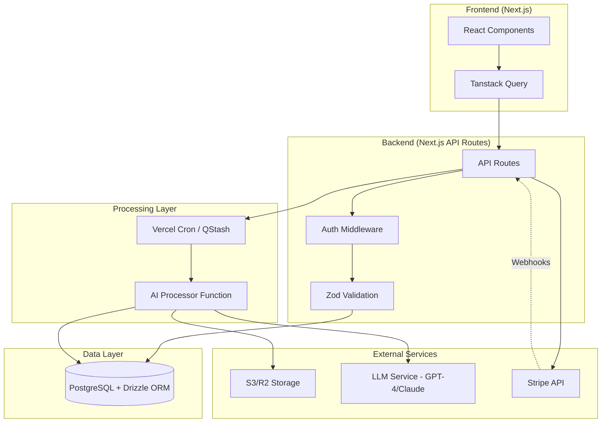
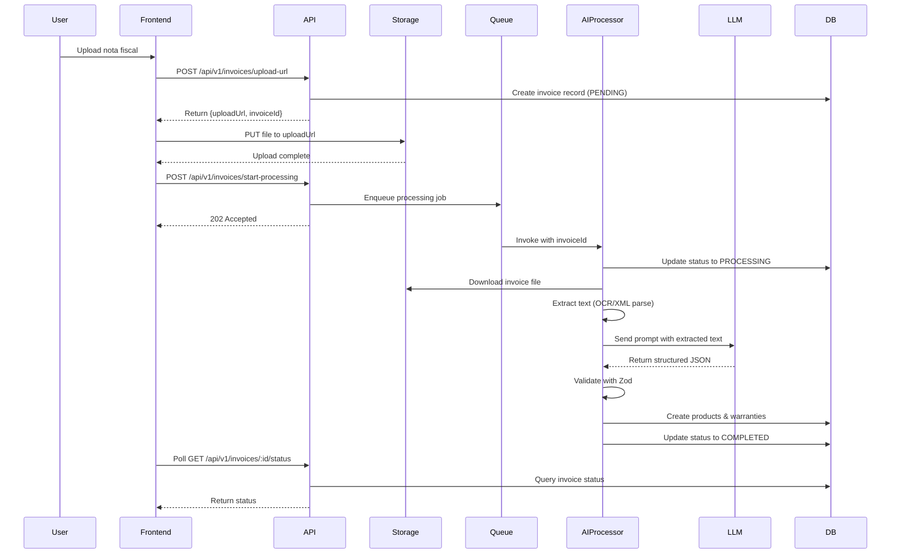

# Design Document

## Overview

Este documento descreve o design técnico para o **Horizonte 2: "Da Clareza à Inteligência"** da plataforma Horizon AI. A solução introduz um motor de IA para processamento de notas fiscais e implementa o modelo de monetização Premium, transformando a plataforma de uma ferramenta de visualização em um cérebro financeiro inteligente.

O design segue os princípios de automação radical, insights acionáveis e segurança perceptível, mantendo a simplicidade da stack Next.js existente enquanto adiciona capacidades assíncronas de processamento de IA.

## Architecture

### High-Level Architecture



### Processing Flow



## Components and Interfaces

### Database Schema Extensions

#### Invoices Table

```typescript
{
  id: string (PK)
  userId: string (FK -> users.id)
  storageUrl: string
  fileName: string
  processingStatus: enum ['PENDING', 'PROCESSING', 'COMPLETED', 'FAILED']
  processingError: string | null
  createdAt: timestamp
}
```

#### Products Table

```typescript
{
  id: string (PK)
  userId: string (FK -> users.id)
  invoiceId: string | null (FK -> invoices.id)
  name: string
  purchasePrice: integer (centavos)
  purchaseDate: timestamp
  createdAt: timestamp
}
```

#### Warranties Table

```typescript
{
  id: string (PK)
  productId: string (FK -> products.id)
  expiresAt: timestamp
  isNotified: boolean
}
```

### API Endpoints

#### Invoice Management

**POST /api/v1/invoices/upload-url**

- Auth: Required (JWT)
- Request: `{ fileName: string, fileType: string }`
- Response: `{ uploadUrl: string, invoiceId: string }`
- Logic: Generate pre-signed URL, create invoice record

**POST /api/v1/invoices/start-processing**

- Auth: Required (JWT)
- Request: `{ invoiceId: string }`
- Response: `202 Accepted`
- Logic: Validate ownership, trigger async processing

**GET /api/v1/invoices/:id/status**

- Auth: Required (JWT)
- Response: `{ status: string, error?: string }`
- Logic: Return current processing status

#### Products & Warranties

**GET /api/v1/products**

- Auth: Required (JWT)
- Query: `{ limit?: number, offset?: number }`
- Response: `{ products: Product[], warranties: Warranty[] }`
- Logic: Return user's products with associated warranties

**GET /api/v1/products/:id**

- Auth: Required (JWT)
- Response: `{ product: Product, warranty: Warranty, invoice: Invoice }`
- Logic: Return detailed product information

#### Billing

**POST /api/v1/billing/create-checkout-session**

- Auth: Required (JWT)
- Request: `{ priceId: string, plan: 'monthly' | 'annual' }`
- Response: `{ url: string }`
- Logic: Create Stripe checkout session with userId in metadata

**POST /api/v1/webhooks/stripe**

- Auth: Webhook signature verification
- Request: Stripe webhook event
- Response: `200 OK`
- Logic: Handle subscription lifecycle events

### AI Processor Function

**Location:** `src/lib/services/invoice-processor.ts`

**Interface:**

```typescript
interface ProcessInvoiceInput {
  invoiceId: string;
}

interface ExtractedData {
  purchaseDate: string; // ISO 8601
  products: Array<{
    name: string;
    priceInCents: number;
  }>;
}

async function processInvoice(input: ProcessInvoiceInput): Promise<void>;
```

**Steps:**

1. Fetch invoice record from DB
2. Download file from storage
3. Extract text (PDF: pdf-parse, XML: native parsing)
4. Call LLM with optimized prompt
5. Validate response with Zod
6. Create products and warranties in DB
7. Update invoice status

### Frontend Components

#### AssetUploadComponent

- File input with drag-and-drop
- Progress indicator during upload
- Real-time status polling using Tanstack Query refetchInterval
- Error handling and retry logic

#### ProductListComponent

- Grid/table layout of products
- Warranty countdown display
- Visual priority for expiring warranties
- Link to original invoice

#### PricingPageComponent

- Plan comparison table
- Feature gating indicators
- Upgrade CTA with Stripe integration

#### UpgradePromptComponent

- Reusable component for feature gating
- Clear value proposition
- Link to pricing page

### Custom Hooks

**useCurrentUser()**

```typescript
function useCurrentUser(): {
  user: User | null;
  isPremium: boolean;
  isLoading: boolean;
};
```

**useInvoiceStatus(invoiceId: string)**

```typescript
function useInvoiceStatus(invoiceId: string): {
  status: ProcessingStatus;
  error?: string;
  isPolling: boolean;
};
```

## Data Models

### Zod Validation Schemas

**Invoice Upload Request**

```typescript
const uploadRequestSchema = z.object({
  fileName: z.string().min(1).max(255),
  fileType: z.enum(["application/pdf", "application/xml", "text/xml"]),
});
```

**LLM Response Schema**

```typescript
const llmResponseSchema = z.object({
  purchaseDate: z.string().datetime(),
  products: z
    .array(
      z.object({
        name: z.string().min(1).max(500),
        priceInCents: z.number().int().positive(),
      })
    )
    .min(1),
});
```

**Stripe Webhook Event**

```typescript
const stripeWebhookSchema = z.object({
  type: z.string(),
  data: z.object({
    object: z.any(),
  }),
});
```

## Error Handling

### Error Categories

1. **Upload Errors**
   - Invalid file type → 400 Bad Request
   - File too large → 413 Payload Too Large
   - Storage service unavailable → 503 Service Unavailable

2. **Processing Errors**
   - OCR/parsing failure → Log error, mark as FAILED
   - LLM timeout → Retry with exponential backoff (max 3 attempts)
   - Invalid LLM response → Log error, mark as FAILED
   - Database write failure → Rollback transaction, mark as FAILED

3. **Authorization Errors**
   - Missing auth token → 401 Unauthorized
   - Invalid token → 401 Unauthorized
   - Resource ownership violation → 403 Forbidden
   - Free user accessing Premium feature → 403 Forbidden

4. **Payment Errors**
   - Stripe API failure → 502 Bad Gateway
   - Invalid webhook signature → 401 Unauthorized
   - Payment declined → Update user notification

### Error Response Format

```typescript
interface ErrorResponse {
  error: {
    code: string;
    message: string;
    details?: Record<string, any>;
  };
}
```

### Retry Strategy

- LLM calls: 3 attempts with exponential backoff (1s, 2s, 4s)
- Storage operations: 2 attempts with 1s delay
- Database operations: No automatic retry (use transactions)
- Webhook processing: Stripe handles retries automatically

## Testing Strategy

### Unit Tests

**Coverage Targets:**

- Validation schemas: 100%
- Business logic functions: 90%
- Utility functions: 90%

**Key Areas:**

- Zod schema validation
- LLM prompt construction
- Warranty expiration calculation
- User role checking

### Integration Tests

**Test Database:**

- Separate PostgreSQL instance for CI/CD
- Reset between test runs
- Seeded with test fixtures

**Critical Flows:**

1. Complete invoice upload and processing flow
2. Stripe checkout session creation
3. Webhook handling and user role update
4. Feature gating enforcement

**Test Environment Variables:**

```
TEST_DATABASE_URL=postgresql://...
STRIPE_TEST_SECRET_KEY=sk_test_...
STRIPE_WEBHOOK_SECRET=whsec_test_...
TEST_STORAGE_BUCKET=test-invoices
```

### E2E Tests (Optional)

**Scenarios:**

- User uploads invoice and sees products appear
- Free user attempts Premium feature and sees upgrade prompt
- User completes payment and gains Premium access

**Tools:** Playwright or Cypress

### Performance Tests

**Benchmarks:**

- Invoice processing: < 2 minutes (p95)
- API response time: < 200ms (p95)
- Page load time: < 1s (p95)

**Monitoring:**

- Vercel Analytics for frontend metrics
- Custom logging for processing times
- Stripe dashboard for payment metrics

## Security Considerations

### Authentication & Authorization

- JWT tokens with short expiration (15 minutes)
- Refresh token rotation
- Role-based access control (FREE, PREMIUM)
- Resource ownership validation on every request

### Data Protection

- Pre-signed URLs with 15-minute expiration
- Server-side encryption for stored files
- No sensitive data in client-side logs
- PCI compliance delegated to Stripe

### API Security

- Rate limiting on all endpoints (100 req/min per user)
- CORS configuration for known origins only
- Webhook signature verification
- Input validation with Zod on all endpoints

### LLM Security

- Sanitize extracted text before sending to LLM
- No user PII in LLM prompts
- Validate and sanitize LLM responses
- Timeout protection (30s max)

## Performance Optimizations

### Frontend

- Lazy loading of asset images
- Virtualized lists for large product collections
- Optimistic updates for better UX
- Debounced search/filter inputs

### Backend

- Database indexes on userId, invoiceId, expiresAt
- Connection pooling for database
- Caching of user role in JWT payload
- Batch operations for warranty notifications

### Processing

- Parallel processing of multiple invoices
- Streaming for large file downloads
- Efficient text extraction (prefer XML over OCR)
- LLM response caching for identical invoices (future)

## Deployment Strategy

### Phase 1: Infrastructure Setup

- Create S3/R2 bucket for invoice storage
- Configure Stripe products and prices
- Set up webhook endpoints in Stripe dashboard
- Deploy database migrations

### Phase 2: Backend Deployment

- Deploy API routes with feature flags disabled
- Deploy AI processor function
- Configure environment variables
- Run integration tests in staging

### Phase 3: Frontend Deployment

- Deploy pricing page (public)
- Deploy assets page (gated)
- Enable feature flags progressively
- Monitor error rates

### Phase 4: Monitoring & Iteration

- Track conversion metrics (free → premium)
- Monitor processing success rate
- Collect user feedback
- Iterate on LLM prompts for better accuracy

## Future Enhancements

1. **Warranty Notifications**
   - Email/push notifications before expiration
   - Configurable notification timing
   - Notification history

2. **Advanced Product Management**
   - Manual product entry
   - Product categories and tags
   - Product images from invoices

3. **Enhanced AI Capabilities**
   - Multi-language support
   - Receipt recognition (not just NF-e)
   - Automatic warranty period detection

4. **Analytics Dashboard**
   - Spending patterns by category
   - Product lifecycle insights
   - Warranty utilization metrics
