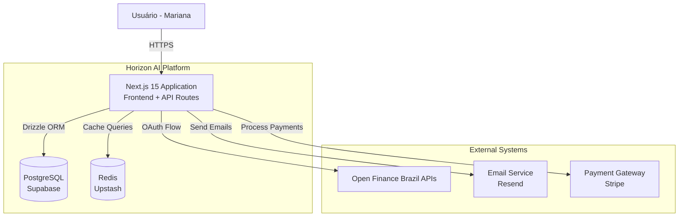
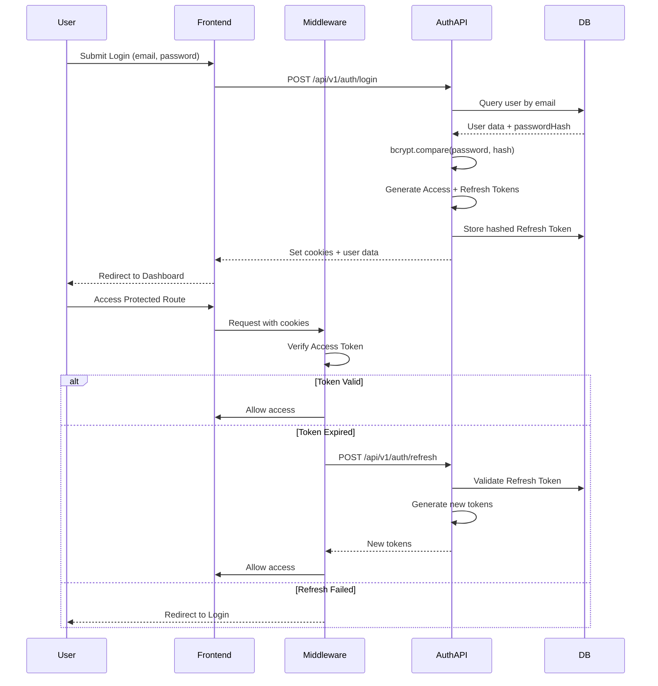
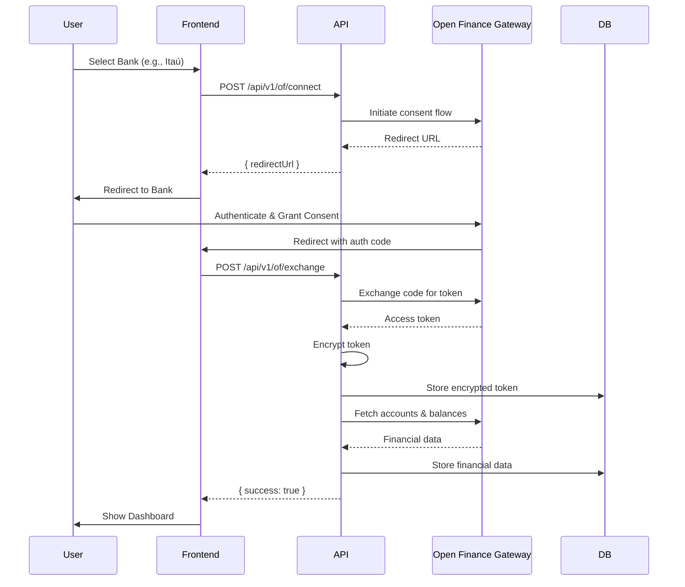
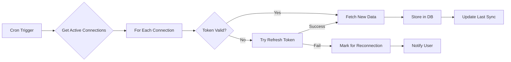
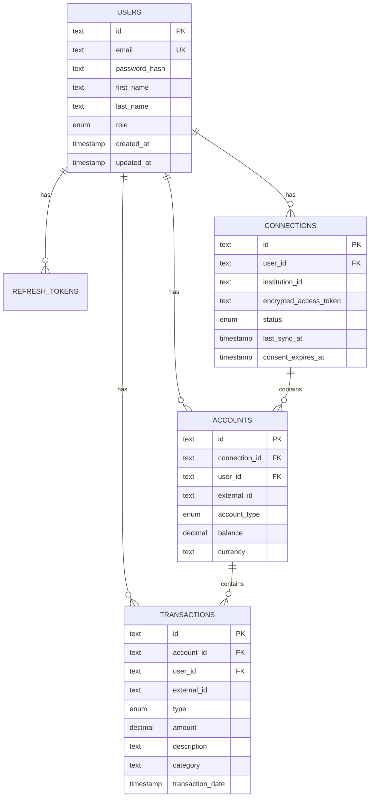

# Design Document

## Overview

O Horizon AI MVP é uma aplicação full-stack construída com Next.js 15 que implementa um sistema de gestão financeira pessoal com foco em consolidação automatizada via Open Finance. A arquitetura é projetada para ser segura, escalável e manter controle total sobre o ciclo de vida da autenticação, evitando vendor lock-in.

A solução utiliza uma abordagem monolítica moderna onde o Next.js serve tanto o frontend (React Server Components) quanto o backend (API Routes), com PostgreSQL como banco de dados principal e Redis para caching. A autenticação é implementada localmente usando JWT, proporcionando controle total e escalabilidade ilimitada de usuários.

## Architecture

### System Architecture (C4 Model - Level 2)



### Technology Stack

**Core Framework:**

- Next.js 15 (App Router) com TypeScript 5.5+ (strict mode)
- React Server Components para renderização otimizada

**Data Layer:**

- Drizzle ORM para acesso type-safe ao banco
- PostgreSQL (Supabase) como banco principal
- Upstash Redis para caching

**Authentication:**

- JWT (jsonwebtoken) para tokens de acesso e refresh
- bcryptjs para hashing de senhas
- cookie para gerenciamento seguro de cookies

**Frontend:**

- Tailwind CSS + Shadcn/UI para componentes
- TanStack Query v5 para data fetching e cache
- Zustand para gerenciamento de estado local

**Validation & Type Safety:**

- Zod para validação de schemas
- TypeScript para type safety em toda a aplicação

**Infrastructure:**

- Vercel para hosting e CI/CD
- GitHub Actions para pipeline de validação
- pnpm como gerenciador de pacotes

## Components and Interfaces

### 1. Authentication System

#### JWT Token Strategy

**Access Token:**

- Duração: 15 minutos
- Payload: `{ userId: string, role: 'FREE' | 'PREMIUM' }`
- Armazenamento: Cookie httpOnly, secure, sameSite: 'strict'
- Propósito: Autorização de requisições

**Refresh Token:**

- Duração: 7 dias
- Payload: `{ userId: string, jti: string }`
- Armazenamento: Hash no banco + Cookie httpOnly
- Propósito: Renovação de Access Tokens

#### Authentication Flow



#### API Endpoints

**POST /api/v1/auth/register**

- Input: `{ email: string, password: string, firstName: string }`
- Validation: Zod schema
- Process: Hash password (bcrypt, salt round 12), create user
- Output: 201 Created
- Errors: 400 (invalid input), 409 (email exists)

**POST /api/v1/auth/login**

- Input: `{ email: string, password: string }`
- Validation: Zod schema
- Process: Verify credentials, generate tokens, set cookies
- Output: 200 OK + user data
- Errors: 401 (invalid credentials), 400 (invalid input)

**POST /api/v1/auth/refresh**

- Input: Refresh token from cookie
- Process: Validate token, generate new pair
- Output: 200 OK + new cookies
- Errors: 401 (invalid/expired token)

### 2. Open Finance Integration

#### Connection Flow



#### API Endpoints

**POST /api/v1/of/connect**

- Input: `{ institution: string }`
- Process: Initiate OAuth flow with selected institution
- Output: `{ redirectUrl: string }`

**POST /api/v1/of/exchange**

- Input: `{ code: string }`
- Process: Exchange auth code, encrypt and store token, sync initial data
- Output: `{ success: boolean }`

**POST /api/v1/of/sync**

- Input: `{ connectionId: string }`
- Process: Fetch latest transactions and balances
- Output: `{ synced: number, lastSync: timestamp }`

### 3. Dashboard and Data Presentation

#### Dashboard Components

**Consolidated Balance Card:**

- Displays total balance across all connected accounts
- Real-time updates via TanStack Query
- Visual breakdown by account type

**Unified Transaction Feed:**

- Chronological list of all transactions
- Smart deduplication (credit card payments vs bank debits)
- Basic auto-categorization
- Infinite scroll with pagination

**Account List:**

- Shows all connected accounts
- Individual balances and last sync time
- Quick actions (sync now, disconnect)

#### Data Fetching Strategy

```typescript
// Using TanStack Query for server state
const { data: dashboard } = useQuery({
  queryKey: ["dashboard"],
  queryFn: () => fetch("/api/v1/dashboard").then((r) => r.json()),
  staleTime: 5 * 60 * 1000, // 5 minutes
  refetchOnWindowFocus: true,
});

// Automatic refetch on auth errors
const queryClient = new QueryClient({
  defaultOptions: {
    queries: {
      retry: (failureCount, error: any) => {
        if (error?.response?.status === 401) {
          handleAuthError(); // Trigger refresh flow
          return false;
        }
        return failureCount < 3;
      },
    },
  },
});
```

### 4. Background Sync System

#### Sync Strategy

**Initial Sync:**

- Triggered immediately after connection
- Fetches last 90 days of transactions
- Stores in database with userId association

**Periodic Sync:**

- Runs every 6 hours for active accounts
- Uses job queue for reliability
- Implements exponential backoff on errors

**On-Demand Sync:**

- Triggered when user opens app (if > 1 hour since last sync)
- Manual sync button in UI
- Rate limited to prevent abuse

#### Sync Job Flow



## Data Models

### Database Schema (Drizzle ORM)

```typescript
// src/lib/db/schema.ts

import {
  pgTable,
  text,
  timestamp,
  pgEnum,
  integer,
  decimal,
  boolean,
} from "drizzle-orm/pg-core";
import { createId } from "@paralleldrive/cuid2";

// Enums
export const userRoleEnum = pgEnum("user_role", ["FREE", "PREMIUM"]);
export const accountTypeEnum = pgEnum("account_type", [
  "CHECKING",
  "SAVINGS",
  "CREDIT_CARD",
  "INVESTMENT",
]);
export const transactionTypeEnum = pgEnum("transaction_type", [
  "DEBIT",
  "CREDIT",
]);
export const connectionStatusEnum = pgEnum("connection_status", [
  "ACTIVE",
  "EXPIRED",
  "ERROR",
  "DISCONNECTED",
]);

// Users Table
export const users = pgTable("users", {
  id: text("id")
    .primaryKey()
    .$defaultFn(() => createId()),
  email: text("email").notNull().unique(),
  passwordHash: text("password_hash").notNull(),
  firstName: text("first_name"),
  lastName: text("last_name"),
  role: userRoleEnum("role").default("FREE").notNull(),
  createdAt: timestamp("created_at", { withTimezone: true })
    .defaultNow()
    .notNull(),
  updatedAt: timestamp("updated_at", { withTimezone: true })
    .defaultNow()
    .notNull(),
});

// Refresh Tokens Table
export const refreshTokens = pgTable("refresh_tokens", {
  id: text("id")
    .primaryKey()
    .$defaultFn(() => createId()),
  hashedToken: text("hashed_token").notNull().unique(),
  userId: text("user_id")
    .notNull()
    .references(() => users.id, { onDelete: "cascade" }),
  expiresAt: timestamp("expires_at", { withTimezone: true }).notNull(),
  createdAt: timestamp("created_at", { withTimezone: true })
    .defaultNow()
    .notNull(),
});

// Open Finance Connections Table
export const connections = pgTable("connections", {
  id: text("id")
    .primaryKey()
    .$defaultFn(() => createId()),
  userId: text("user_id")
    .notNull()
    .references(() => users.id, { onDelete: "cascade" }),
  institutionId: text("institution_id").notNull(),
  institutionName: text("institution_name").notNull(),
  encryptedAccessToken: text("encrypted_access_token").notNull(),
  encryptedRefreshToken: text("encrypted_refresh_token"),
  tokenExpiresAt: timestamp("token_expires_at", { withTimezone: true }),
  status: connectionStatusEnum("status").default("ACTIVE").notNull(),
  lastSyncAt: timestamp("last_sync_at", { withTimezone: true }),
  consentExpiresAt: timestamp("consent_expires_at", { withTimezone: true }),
  createdAt: timestamp("created_at", { withTimezone: true })
    .defaultNow()
    .notNull(),
  updatedAt: timestamp("updated_at", { withTimezone: true })
    .defaultNow()
    .notNull(),
});

// Financial Accounts Table
export const accounts = pgTable("accounts", {
  id: text("id")
    .primaryKey()
    .$defaultFn(() => createId()),
  connectionId: text("connection_id")
    .notNull()
    .references(() => connections.id, { onDelete: "cascade" }),
  userId: text("user_id")
    .notNull()
    .references(() => users.id, { onDelete: "cascade" }),
  externalId: text("external_id").notNull(), // ID from the bank
  accountType: accountTypeEnum("account_type").notNull(),
  accountNumber: text("account_number"),
  balance: decimal("balance", { precision: 15, scale: 2 }).notNull(),
  currency: text("currency").default("BRL").notNull(),
  name: text("name"),
  createdAt: timestamp("created_at", { withTimezone: true })
    .defaultNow()
    .notNull(),
  updatedAt: timestamp("updated_at", { withTimezone: true })
    .defaultNow()
    .notNull(),
});

// Transactions Table
export const transactions = pgTable("transactions", {
  id: text("id")
    .primaryKey()
    .$defaultFn(() => createId()),
  accountId: text("account_id")
    .notNull()
    .references(() => accounts.id, { onDelete: "cascade" }),
  userId: text("user_id")
    .notNull()
    .references(() => users.id, { onDelete: "cascade" }),
  externalId: text("external_id").notNull(),
  type: transactionTypeEnum("type").notNull(),
  amount: decimal("amount", { precision: 15, scale: 2 }).notNull(),
  description: text("description").notNull(),
  category: text("category"), // Auto-categorized
  transactionDate: timestamp("transaction_date", {
    withTimezone: true,
  }).notNull(),
  createdAt: timestamp("created_at", { withTimezone: true })
    .defaultNow()
    .notNull(),
});

// Indexes for performance
// CREATE INDEX idx_transactions_user_date ON transactions(user_id, transaction_date DESC);
// CREATE INDEX idx_accounts_user ON accounts(user_id);
// CREATE INDEX idx_connections_user_status ON connections(user_id, status);
```

### Data Relationships



## Error Handling

### Error Categories and Responses

**Authentication Errors (401):**

- Invalid credentials
- Expired tokens
- Missing authentication
- Response: Redirect to login or trigger refresh flow

**Authorization Errors (403):**

- Attempting to access another user's data
- Response: 403 Forbidden with generic message

**Validation Errors (400):**

- Invalid input format
- Missing required fields
- Response: Detailed validation errors from Zod

**Resource Errors (404):**

- Account not found
- Connection not found
- Response: 404 with clear message

**External API Errors (502/503):**

- Open Finance API unavailable
- Bank timeout
- Response: User-friendly error with retry option

**Server Errors (500):**

- Unexpected errors
- Database failures
- Response: Generic error message, log details for debugging

### Error Handling Pattern

```typescript
// API Route error handling
export async function POST(request: Request) {
  try {
    const userId = await getUserIdFromRequest(request);
    const body = await request.json();

    // Validate with Zod
    const validated = schema.parse(body);

    // Business logic
    const result = await performOperation(userId, validated);

    return NextResponse.json(result);
  } catch (error) {
    if (error instanceof z.ZodError) {
      return NextResponse.json(
        { error: "Validation failed", details: error.errors },
        { status: 400 }
      );
    }

    if (error instanceof AuthError) {
      return NextResponse.json({ error: "Unauthorized" }, { status: 401 });
    }

    // Log unexpected errors
    console.error("Unexpected error:", error);

    return NextResponse.json(
      { error: "Internal server error" },
      { status: 500 }
    );
  }
}
```

### Frontend Error Handling

```typescript
// TanStack Query error handling
const { data, error, isError } = useQuery({
  queryKey: ["dashboard"],
  queryFn: fetchDashboard,
  retry: (failureCount, error) => {
    // Don't retry on auth errors
    if (error.status === 401) return false;
    // Retry up to 3 times for other errors
    return failureCount < 3;
  },
});

if (isError) {
  return <ErrorState error={error} />;
}
```

## Testing Strategy

### Unit Tests

- Authentication utilities (token generation, password hashing)
- Validation schemas (Zod)
- Data transformation functions
- Categorization logic

### Integration Tests

- API endpoints (auth, Open Finance, dashboard)
- Database operations (CRUD)
- Middleware (auth verification)
- End-to-end flows (registration → login → dashboard)

### E2E Tests (Optional for MVP)

- Complete onboarding flow
- Account connection flow
- Dashboard interaction

### Security Tests

- SQL injection prevention
- XSS prevention
- CSRF protection via sameSite cookies
- Authorization bypass attempts

### Performance Tests

- API response times (<200ms target)
- Dashboard load time (<3s target)
- Concurrent user load testing

### Test Tools

- Vitest for unit and integration tests
- Playwright for E2E tests (if implemented)
- Jest for component testing

## Security Considerations

### Authentication Security

- Passwords hashed with bcrypt (salt round 12)
- JWT secrets stored securely in environment variables
- Refresh tokens hashed before storage
- Cookies configured as httpOnly, secure, sameSite: 'strict'
- Token rotation on refresh

### Authorization Security

- All queries filtered by userId at application layer
- No reliance on client-side authorization
- Middleware validates tokens on every protected route
- User context extracted from verified JWT payload

### Data Security

- Open Finance tokens encrypted at rest
- All communication over HTTPS/TLS
- Database credentials in environment variables
- No sensitive data in logs
- LGPD compliance for personal data

### API Security

- Rate limiting on authentication endpoints
- Input validation with Zod on all endpoints
- CORS configured for specific origins
- No verbose error messages in production

### Infrastructure Security

- Environment variables managed via Vercel
- Database access restricted to application
- Regular security audits
- Dependency vulnerability scanning

## Performance Optimization

### Caching Strategy

- Redis cache for frequently accessed data
- TanStack Query cache on client (5 min stale time)
- Database query result caching
- Static asset caching via Vercel CDN

### Database Optimization

- Indexes on frequently queried columns (userId, transactionDate)
- Connection pooling
- Query optimization with Drizzle
- Pagination for large result sets

### Frontend Optimization

- React Server Components for initial render
- Code splitting and lazy loading
- Image optimization with Next.js Image
- Prefetching for anticipated navigation

### API Optimization

- Response compression
- Efficient JSON serialization
- Batch operations where possible
- Async processing for heavy operations

## Deployment and DevOps

### CI/CD Pipeline

```yaml
# .github/workflows/validate.yml
name: Validate PR
on:
  pull_request:
    branches: ["main"]

jobs:
  build-and-test:
    runs-on: ubuntu-latest
    steps:
      - Checkout code
      - Install pnpm
      - Setup Node.js 20
      - Install dependencies
      - Run linting
      - Run type checking
      - Run tests (when implemented)
      - Build project
```

### Deployment Strategy

- Automatic deployment to Vercel on merge to main
- Preview deployments for all PRs
- Environment-specific configurations
- Database migrations applied before deployment

### Monitoring and Observability

- Vercel Analytics for performance metrics
- Error tracking (Sentry or similar)
- Database query monitoring
- API endpoint metrics
- User behavior analytics

### Backup and Recovery

- Automated database backups (Supabase)
- Point-in-time recovery capability
- Disaster recovery plan
- Data retention policies

## Scalability Considerations

### Horizontal Scaling

- Stateless application design
- Session data in database (refresh tokens)
- Load balancing via Vercel
- Database connection pooling

### Vertical Scaling

- Database upgrade path (Supabase tiers)
- Redis memory scaling (Upstash)
- Optimized queries and indexes

### Future Considerations

- Microservices extraction for heavy operations
- Message queue for async jobs (sync, notifications)
- CDN for static assets
- Multi-region deployment
