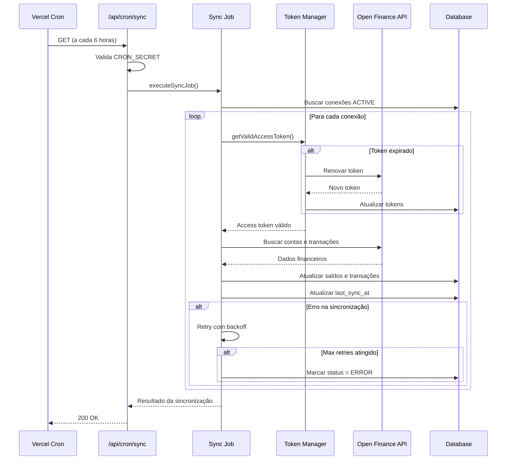

# Sistema de Sincronização Periódica

Este documento descreve o sistema de sincronização periódica implementado para o Horizon AI MVP.

## Visão Geral

O sistema de sincronização mantém os dados financeiros dos usuários atualizados automaticamente, buscando novas transações e saldos das instituições financeiras conectadas via Open Finance.

## Componentes

### 1. Endpoint de Sincronização (`/api/v1/of/sync`)

**Método:** POST

**Payload:**

```json
{
  "connectionId": "string"
}
```

**Funcionalidades:**

- Valida que a conexão pertence ao usuário autenticado
- Implementa rate limiting (1 sync por minuto por conexão)
- Renova tokens automaticamente se expirados
- Busca novos dados desde a última sincronização
- Atualiza saldos e transações no banco de dados

**Respostas:**

- `200 OK`: Sincronização bem-sucedida
- `400 Bad Request`: Conexão inválida ou desconectada
- `404 Not Found`: Conexão não encontrada
- `429 Too Many Requests`: Rate limit excedido
- `500 Internal Server Error`: Erro durante sincronização

### 2. Job de Sincronização Periódica (`src/lib/jobs/sync-job.ts`)

**Função:** `executeSyncJob()`

**Funcionalidades:**

- Busca todas as conexões ativas
- Executa sincronização para cada conexão
- Implementa backoff exponencial em caso de erros (3 tentativas)
- Atualiza status das conexões (ACTIVE, ERROR, EXPIRED)
- Registra logs detalhados de cada operação

**Retry Logic:**

- Tentativa 1: Imediato
- Tentativa 2: Após 2 segundos
- Tentativa 3: Após 4 segundos
- Tentativa 4: Após 8 segundos

### 3. Cron Job Endpoint (`/api/cron/sync`)

**Método:** GET ou POST

**Autenticação:** Bearer token via header `Authorization`

**Configuração:**

- Executa a cada 6 horas (configurado em `vercel.json`)
- Cron expression: `0 */6 * * *`

**Segurança:**

- Requer `CRON_SECRET` no header de autorização
- Apenas requisições autenticadas são processadas

**Configuração no Vercel:**

```json
{
  "crons": [
    {
      "path": "/api/cron/sync",
      "schedule": "0 */6 * * *"
    }
  ]
}
```

### 4. Sistema de Renovação de Tokens (`src/lib/of/tokens.ts`)

**Função:** `renewOpenFinanceToken(connectionId: string)`

**Funcionalidades:**

- Detecta tokens expirados ou prestes a expirar (< 5 minutos)
- Usa refresh token para obter novo access token
- Atualiza tokens criptografados no banco de dados
- Marca conexão como EXPIRED se renovação falhar

**Função:** `getValidAccessToken(connectionId: string)`

**Funcionalidades:**

- Retorna token válido para uma conexão
- Renova automaticamente se expirado
- Retorna `null` se renovação falhar

### 5. Rate Limiter (`src/lib/utils/rate-limiter.ts`)

**Implementação:** In-memory (para MVP)

**Configuração:**

- 1 sincronização por minuto por conexão
- Limpeza automática de entradas expiradas a cada 5 minutos

**Nota:** Em produção, deve ser substituído por Redis para suportar múltiplas instâncias.

### 6. Sincronização On-Demand

**Localização:** Dashboard (`src/app/(app)/dashboard/page.tsx`)

**Funcionalidades:**

- Botão "Sincronizar" em cada conta
- Auto-sync ao abrir o app se última sincronização > 1 hora
- Feedback visual durante sincronização
- Mensagens de sucesso/erro via toast

## Fluxo de Sincronização



## Variáveis de Ambiente

```bash
# Cron Jobs
CRON_SECRET=your-cron-secret-token-here

# Open Finance
OPEN_FINANCE_CLIENT_ID=your-client-id
OPEN_FINANCE_CLIENT_SECRET=your-client-secret
OPEN_FINANCE_API_URL=https://api.openfinance.example.com

# Encryption
ENCRYPTION_KEY=your-32-character-encryption-key
```

## Monitoramento

### Logs

Todos os eventos importantes são registrados:

- Início e fim de cada job de sincronização
- Sucessos e falhas por conexão
- Tentativas de renovação de token
- Erros e exceções

### Métricas Recomendadas

- Taxa de sucesso de sincronizações
- Tempo médio de sincronização
- Número de tokens renovados
- Número de conexões marcadas como EXPIRED/ERROR

## Tratamento de Erros

### Token Expirado

- Sistema tenta renovar automaticamente
- Se falhar, marca conexão como EXPIRED
- Usuário é notificado para reconectar

### Erro de API

- Implementa retry com backoff exponencial
- Após 3 tentativas, marca conexão como ERROR
- Registra erro para debugging

### Rate Limit

- Retorna 429 com tempo de espera
- Cliente deve aguardar antes de tentar novamente

## Melhorias Futuras

1. **Redis para Rate Limiting**
   - Suportar múltiplas instâncias da aplicação
   - Rate limiting distribuído

2. **Fila de Jobs**
   - Usar serviço como BullMQ ou AWS SQS
   - Melhor controle de concorrência
   - Retry automático com dead letter queue

3. **Notificações**
   - Email quando conexão expira
   - Push notification para novas transações importantes

4. **Sincronização Inteligente**
   - Ajustar frequência baseado em atividade da conta
   - Priorizar contas com mais transações

5. **Webhooks**
   - Receber notificações push das instituições
   - Sincronização em tempo real quando disponível

## Testes

### Testar Endpoint de Sincronização

```bash
curl -X POST http://localhost:3000/api/v1/of/sync \
  -H "Content-Type: application/json" \
  -H "Cookie: accessToken=YOUR_TOKEN" \
  -d '{"connectionId": "CONNECTION_ID"}'
```

### Testar Cron Job Localmente

```bash
curl -X GET http://localhost:3000/api/cron/sync \
  -H "Authorization: Bearer YOUR_CRON_SECRET"
```

### Testar Rate Limiting

Execute múltiplas requisições em sequência rápida:

```bash
for i in {1..3}; do
  curl -X POST http://localhost:3000/api/v1/of/sync \
    -H "Content-Type: application/json" \
    -H "Cookie: accessToken=YOUR_TOKEN" \
    -d '{"connectionId": "CONNECTION_ID"}'
  echo ""
done
```

A terceira requisição deve retornar 429.

## Troubleshooting

### Sincronização não está executando

1. Verificar se `CRON_SECRET` está configurado
2. Verificar logs do Vercel Cron
3. Verificar se há conexões ACTIVE no banco

### Tokens expirando frequentemente

1. Verificar configuração do Open Finance
2. Verificar se refresh tokens estão sendo salvos
3. Verificar logs de renovação de token

### Rate limit muito restritivo

Ajustar configuração em `src/app/api/v1/of/sync/route.ts`:

```typescript
const rateLimitWindow = 60 * 1000; // 1 minuto
const rateLimitMax = 1; // 1 requisição
```
